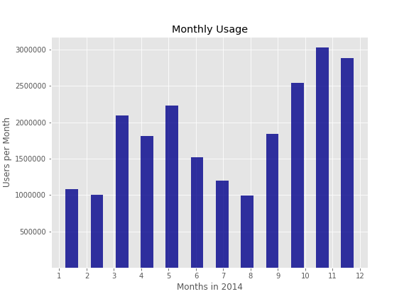

# junyi_app_user
### Can we predict who will be using Junyi Academy next month based on usage features?  

The company wants to know what features are important to understand who will use from one month to the next.   They want to roll out a new feature that can be unlocked by longer term users. Live Online Tutoring!!! 

A benevolent tech giant want to donate the staff time to hold live Zoom tutoring sessions. This is valued at 100 dollars per hour of tutoring, but they need about a month to get staffing together. They have a want to give 25,000 dollars per month.  If we can't say that we will use it, they may find another online learning platform.  

Soo....Data Science anyone? 

## What is the backstory? 

As public schools have shut down across the country, students and educators at all levels have been forced to develop new strategies.  One of the primary strategies has been educational apps.  

In my case my 7 year old son, his teachers have directed us towards Splash Math for Math and Epic Books for reading practice. Because the teachers are connected to these apps, they are able to see our son's progress. On top of this we have been using two additional apps to help him keep up with his studies. We are using Duolingo for Chinese and Khan Academy for Math.   

As the school closure persists and the possibility of an even longer closure persists. I wonder how long will we stick with these apps.  Typically with educational apps, I stick with them for a little while, but I get bored and then stop.  With a long term school closure, the stakes seem much higher. As parents are working and have less time than a clasroom teacher, we are relying on apps to teach and engage our students more and for longer than ever.  

Unfortunately, the apps that we are using don't make their data publicly available.  

Finding a good set of education app/website data was not easy! After a lot of searching across of a variety of open data platforms.  Fortunately, I found the [DataShop](https://pslcdatashop.web.cmu.edu/index.jspat) Carnegie Mellon University.  The website has datasets specifically targeted towards learing science. Here I was able to locate the [Junyi Academy Math](https://pslcdatashop.web.cmu.edu/Project?id=244) dataset. 

## What is Junyi Academy
[Junyi Academy](https://www.junyiacademy.org/) is a Chinese platform that was started with the help of Khan Academy, and uses many of the same strategies and metrics to teach students.   In this way, it will provide an approximation of the applications that many students around the world are currently using.  

<table> 
<tr>
<td>
 
    </td>
<td> 
  
</td>    
<td>
  
    </td>
</table> 
    
This data focuses on Geometry and Algrebra lessons in the platform from October 2013 to January 2015. The entire dataset was used to complete EDA.  For modelling and predictions, the 2014 calendar year was used.   

## Process

### EDA
To get a better sense of the entire data set, I performed exploratory data analysis.  I used the exploratory data analysis to get a sense of what feature engineering would be necessary.  

**Days Active**

Around 2/3 of the users in the dataset were only active a single day. Looking at 10 days of usage, the curve flattens out, so I decided to use users with more than 10 days of usage for my prediction.    

**Activities**

 
There is a large spike at 10 activities.  This could be attributed to the fact that 10 correct activities in a row are needed to earn a proficiency in a topic.   Nearly half of all of the users in dataset got to this level of activities and then stopped using the site.   

**Days Active vs. Activities**

This plot demonstrates that most of the usage clusters toward the bottom right, but there is also a wide variety of usage that extends beyond a hundred days and many thousands of activities.   

*Months?* 
It is possible to see that usage varies by month, especially during July and August. Schools in China take a break during this season too, but usage ramps up in the fall.   

### Data Preparation 
The data was loaded into a Pandas DataFrame and cleaned. They data consisted a variety of information related to each excercise taken by a student.  

To predict user whether a user would be active I needed aggregate the user information into a new table and engineer features that improve the prediction. 

### Modeling
The initial model was a Logistic Regression performed using the mean statistics of users over the first 6 months of 2014 and then trying to predict whether these users would be active in the second part of the year. 

Because the churn rate is so high on this user set, the target value is heavily weighted. This made predicting a churn very easy and in general the accuracy score was high. For the purposes of predicting who will remain a user, the recall and precision scores are much more valuable. These scores were very low in the initial model.  

I reviewed the beta-coefficients in the initial logistic regression. to get a sense of which features were impacting the prediction. It looked like the features of correct answers, whether hints were used, and the amount hints used were the most impactful.  

After getting a basic idea of the prediction ability of logistic regression model.  I moved to a Random Forest Classifier.  This improved both my recall and precision scores.  I used a GridSearch to settle on the hyperparameters to use on the Random Forest. Next, I tried a Gradient Boosting Classifier as well. I used a GridSearch to settle on the hyperparameters to use.  This improved my recall, but lowered the precision.  After each round of modelling, I engineered additional columns. For example, I added columns to determine the amount activities completed, the days active before the prediction date.  Finally, I made the decision to cut the data set to users who had more than 10 days of active use.  This impacted my accuracy score. 

I trained on the data from January 1st through September 30th, and set my target to predit who would be active in October.  I created a final testing set with the November data to predict would be active in December.  

#### Random Forest Model Prediction for October

**Dev Testing**

|     |  Actual+   |  Actual-   |
|----:|:-----------|:-----------|
|Pred+|    759    |    225    |
|Pred-|    610    |   4368     |
    
 
|         |    Score |   
|--------:|:--------|
|Accuracy | .860    |   
|Precision|   .771 |   
Recall    |       .554 |

 
  
   

### Gradient Boosting Classifier Model Prediction for October

|     |  Actual+   |  Actual-    |
|----:|:-----------|:-----------:|
|Pred+|    779    |    305      |
|Pred-|    581    |   4297      |  
    
 
|         |    Score |   
|--------:|:--------|
|Accuracy | .851    |   
|Precision|   .719 |   
Recall    |       .573 |

 

  
    
 
### What happened in December? 
Looking at the ROC plots above, it looks like something happened in our final testing set.  
   
|         |   GBC Score |  RFC Score| 
|--------:|:--------|---------------|
|Accuracy | .693    |   .860        |
|Precision|   .801 |   .771   |
|Recall    |       .772 | .554  |

I had looked at monthly usage before but I did not think that the churn would change so much in a month. Our model had not seen this data yet.  

**GBR Final Confusion Matrix**
As seen in the confusion matrix, our true positives went way up.  Overall the churn seemed to decrease in December. 

|     |  Actual+   |  Actual-    |              
|----|-----------|-----------|
|Pred+|    3596    |    981      |
|Pred-|    1167    |   890      |      

## Conclusions
The retention rate of users who met our criteria increased from 22% in October to 71% in December. It is difficult with the set of the data determine if this seasonal or a general uptick. Students could be cramming for Geometry and Algebra finals.  We do see a general uptick in usage over the course of the year.  Further statitistical anaylsis could be done to see if this is a significant increase.   

**Assumption Time** 

Back to the problem at hand, can we get enough long term users to use tutoring in order to meet the needs of the benevolent tech giant.  

We think students may be willing to do 4 hours per month of tutoring at a cost 100 dollars per hour. and we assume that 5% of retaining students who get the offer accept. Next, we assume that .25% of incorrectly predicted actually retain and accept.  Unfortunately, our prediction misses on the false negagtives so they are costing us.  Let's put this in dollars.      

|     |  Actual+   |  Actual-    |
|----:|:-----------|:-----------:|
|Pred +|   20   |    1     |
|Pred-|   0 (20?)    |   0     |  
 
So if we use our predicted retainers alone, we would expect 15,885 if we think our October prediction is closer to normal or 80,000 in spending if we thought our December prediction was the new reality.  

If we could include our false negatives we would be at 27,505 and 103,341 respectively, but this would be an overspend of the 25,000.    I think we are closer to the October. 

Boss do you want to be risky?  If we underspend, we don't look good to a the benevolent tech giant.  If we overspend, you might have to cut my pay!  I wish our model predicted better.  

### Future Work and Additional Data Points of Interest
- Significance testing on the December user gain
- Additional feature engineering
- Some additional data points may have increased the ability to predict who would stay active. 
    -  Logged-in vs. Guest User
